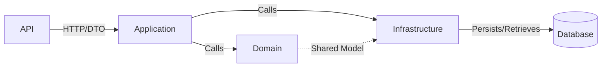
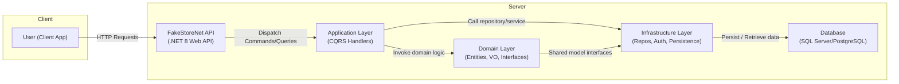

# Context Map for FakeStoreNet

This document describes the relationships between the bounded contexts in the FakeStoreNet application using DDD context mapping patterns.

---

## Bounded Contexts

1. **Domain**  
   - Core business rules: entities, value objects, repository and domain service interfaces.  
2. **Application**  
   - Coordinates use cases, applies business behavior and orchestrates operations between Domain and Infrastructure.  
3. **Infrastructure**  
   - Implements interfaces defined in Domain and Application (repositories, authentication services, JWT, persistence configuration).  
4. **API**  
   - Exposes HTTP endpoints for application use cases: maps Models/DTOs, validates input/output, and applies middleware.

---

## Relationships & Patterns

| Origin         | Target         | Pattern               | Description                                                           |
| -------------- | -------------- | --------------------- | --------------------------------------------------------------------- |
| Domain         | Infrastructure | Published Language    | Domain defines interfaces; Infrastructure implements those contracts. |
| Infrastructure | Domain         | Open Host Service     | Infrastructure exposes persistence and security services via DI.      |
| Application    | Domain         | Conformist            | Application adopts the domain model directly (shared vocabulary).     |
| Application    | Infrastructure | Anti-Corruption Layer | Application communicates through repository and service interfaces.   |
| API            | Application    | Conformist            | API consumes Application Services using defined DTOs and contracts.   |

---

## Call Flow

### Overview

- **API → Application**: Controllers invoke Command/Query Handlers in Application.  
- **Application → Domain**: Handlers create and manipulate entities, value objects, and invoke repository interfaces.  
- **Application → Infrastructure**: Via dependency injection, Application calls repository and infrastructure services.  
- **Infrastructure → Database**: Infrastructure components persist and retrieve data.  

### Extended

