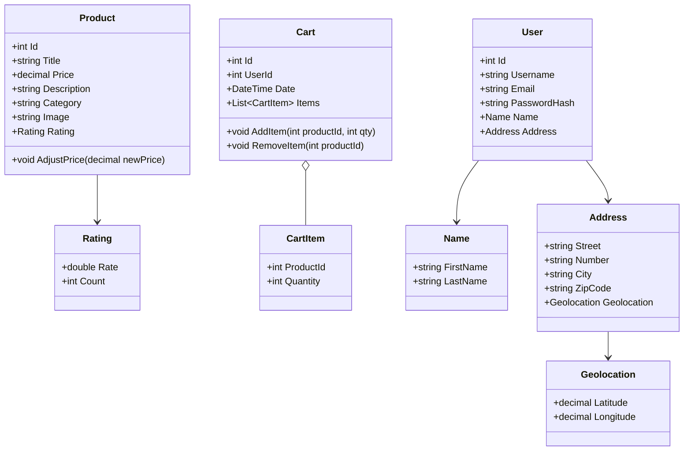

```mermaid
classDiagram
    class Product {
        +int Id
        +string Title
        +decimal Price
        +string Description
        +string Category
        +string Image
        +Rating Rating
        +void AdjustPrice(decimal newPrice)
    }
    class Rating {
        +double Rate
        +int Count
    }
    Product --> Rating

    class Cart {
        +int Id
        +int UserId
        +DateTime Date
        +List~CartItem~ Items
        +void AddItem(int productId, int qty)
        +void RemoveItem(int productId)
    }
    class CartItem {
        +int ProductId
        +int Quantity
    }
    Cart o-- CartItem

    class User {
        +int Id
        +string Username
        +string Email
        +string PasswordHash
        +Name Name
        +Address Address
    }
    class Name {
        +string FirstName
        +string LastName
    }
    class Address {
        +string Street
        +string Number
        +string City
        +string ZipCode
        +Geolocation Geolocation
    }
    class Geolocation {
        +decimal Latitude
        +decimal Longitude
    }
    User --> Name
    User --> Address
    Address --> Geolocation
```